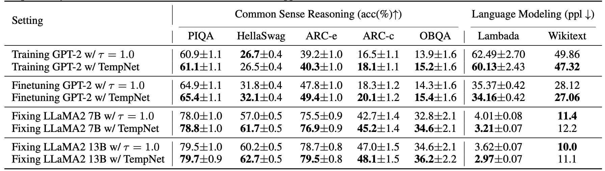
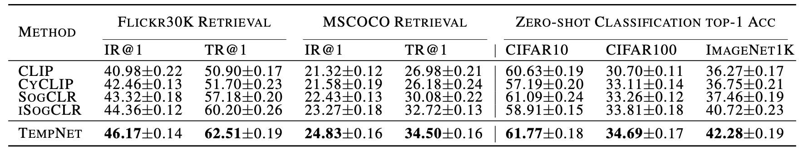

<h1 align="center">To Cool or not to Cool? <br>
Temperature Network Meets Large Foundation Models via DRO </h1>

The temperature parameter plays a profound role  during training and/or inference with large foundation models (LFMs) such as large language models (LLMs) and CLIP models. Particularly, it adjusts the logits in the softmax function in LLMs, which is crucial for next token generation, and it scales the similarities in the contrastive loss for training CLIP models. A significant question remains: "*Is it viable to learn a neural network to predict a personalized temperature of any input data for enhancing LFMs?*"  In this paper, we present **a principled framework** for learning a small yet generalizable temperature prediction network (TempNet) to improve LFMs. Our solution is composed of a novel learning framework with robust losses underpinned by constrained distributionally robust optimization (DRO), and a properly designed TempNet with theoretical inspiration. TempNet can be trained together with a large foundation model from scratch or learned separately given a pretrained foundation model. It is not only useful for predicting personalized temperature to promote the training of LFMs but also generalizable and transferable to new tasks. Our experiments on LLMs and CLIP models demonstrate that TempNet greatly improves the performance of existing solutions or models.

### Table of Contents  

- [Introduction](#introduction)
- [Training](#training)
- [Inference](#inference)
- [Acknowledgment](#acknowledgment)
- [Citation](#citation)

## Introduction

### Our Proposed Method

We introduce **a principled framework** for developing a small yet generalizable network for temperature prediction, TempNet, aimed at enhancing large foundation models (LFMs) such as large language models (LLMs) and CLIP models. The Temperature Network is a plug-and-play architecture that can be implemented atop LFMs. Our solution is composed of a novel learning framework with robust losses underpinned by constrained distributionally robust optimization (DRO), and a properly designed TempNet with theoretical inspiration. TempNet can be trained together with a large foundation model from scratch or learned separately given a pretrained foundation model. It is not only useful for predicting personalized temperature to promote the training of LFMs but also generalizable and transferable to new tasks.

<div align="center" style="display: flex; justify-content: center; align-items: center;">
  
</div>

In the figure above, we present the framework of training LFMs with TempNet on the left and the structure of TempNet on the right.


### Experimental Results

Results of training LLMs in various settings, including training from scratch, finetuning a pretrained LLM model, and learning TempNet only with a frozen LLM model.

<div align="center">
  
</div>

Results on contrastive learning. For image-text retrieval on Flickr30K and MSCOCO, we compute IR@1 and TR@1 for the Recall@1 on image-retrieval (IR) and text-retrieval (TR). For classification tasks, we compute top-1 accuracy (\%). We report the average of scores and standard deviation over 3 runs with different random seeds.

<div align="center">
  
</div>

### More Details
For more details, please refer to our [paper]() 


## Training

We conduct experiments across various tasks and models to validate the effectiveness of TempNet. Given the different training frameworks required by each model, we distribute the training code for different models across four directories: `GPT_2`, `LLaMA-1`, `LLaMA-2`, and `Bimodal-CL`.

## Inference

We upload the base models for LLaMA 2 Chat 7B, 13B, 70B, and their respective TempNets to [Hugging Face](https://huggingface.co/LLM-Opt). An example code for inference using our TempNet is as follows:

```python
from tempnet import LLaMA_TempNet
from transformers import AutoTokenizer, GenerationConfig

model_name = 'LLM-Opt/TempNet-LLaMA2-Chat-7B-v0.1'

tokenizer = AutoTokenizer.from_pretrained(model_name, legacy=False)
generation_config = GenerationConfig.from_pretrained(model_name)
model = LLaMA_TempNet.from_pretrained(model_name, device_map="auto", torch_dtype=torch.float16)

inputs = 'How do you get water in the desert?'
input_ids = tokenizer(inputs, return_tensors="pt").input_ids.cuda()

outputs = model.generate(input_ids, generation_config=generation_config)
response = tokenizer.decode(outputs[0], skip_special_tokens=True)[len(inputs)-1:].strip()
```

## Acknowledgment

This repository benefits from [ALBEF](https://github.com/salesforce/ALBEF), [GPT-NeoX](https://github.com/EleutherAI/gpt-neox), [LLaMA](https://ai.facebook.com/blog/large-language-model-llama-meta-ai), [Megatron-LM](https://github.com/NVIDIA/Megatron-LM), [lm-evaluation-harness](https://github.com/EleutherAI/lm-evaluation-harness), [Stanford Alpaca](https://github.com/tatsu-lab/stanford_alpaca), and [DeepSpeed](https://github.com/microsoft/DeepSpeed).

Thanks for their wonderful works and their efforts to further research.

## Citation
If you find this tutorial helpful, please cite our paper:
```
@article{qiu2024to,
  title={To Cool or not to Cool? Temperature Network Meets Large Foundation Models via DRO},
  author={Zi-Hao Qiu, Siqi Guo, Mao Xu, Tuo Zhao, Lijun Zhang, and Tianbao Yang},
  journal={arXiv preprint arXiv:TBD},
  year={2024}
}
```
