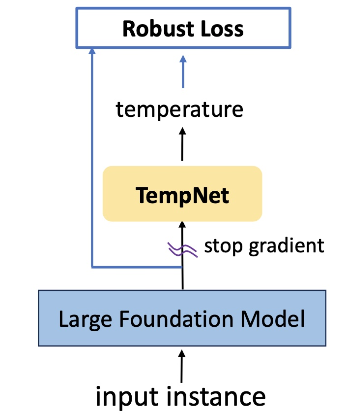
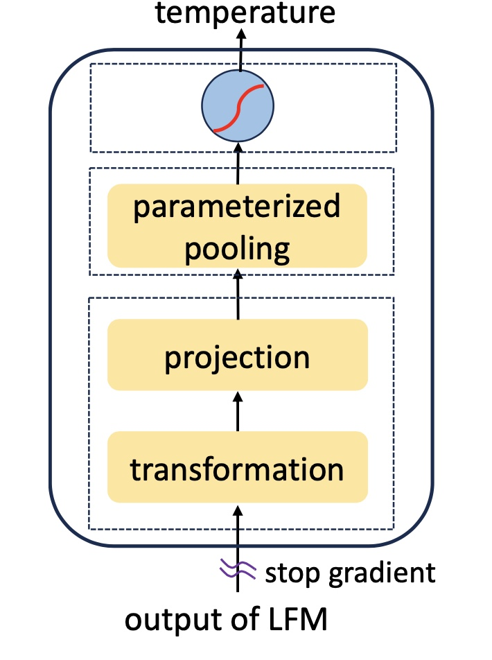

<h1 align="center">To Cool or not to Cool?  
Temperature Network Meets Large Foundation Models via DRO </h1>

The temperature parameter plays a profound role  during training and/or inference with large foundation models (LFMs) such as large language models (LLMs) and CLIP models. Particularly, it adjusts the logits in the softmax function in LLMs, which is crucial for next token generation, and it scales the similarities in the contrastive loss for training CLIP models. A significant question remains: "*Is it viable to learn a neural network to predict a personalized temperature of any input data for enhancing LFMs?*"  In this paper, we present **a principled framework** for learning a small yet generalizable temperature prediction network (TempNet) to improve LFMs. Our solution is composed of a novel learning framework with robust losses underpinned by constrained distributionally robust optimization (DRO), and a properly designed TempNet with theoretical inspiration. TempNet can be trained together with a large foundation model from scratch or learned separately given a pretrained foundation model. It is not only useful for predicting personalized temperature to promote the training of LFMs but also generalizable and transferable to new tasks. Our experiments on LLMs and CLIP models demonstrate that TempNet greatly improves the performance of existing solutions or models.

### Table of Contents  

- [Introduction](#introduction)
- [Installation](#installation)
- [Training](#training)
- [Models](#models)
- [Inference](#inference)
- [Acknowledgment](#acknowledgment)

## Introduction

### Our Proposed Method

We introduce **a principled framework** for developing a small yet generalizable network for temperature prediction, TempNet, aimed at enhancing large foundation models (LFMs) such as large language models (LLMs) and CLIP models. The Temperature Network is a plug-and-play architecture that can be implemented atop LFMs. Our solution is composed of a novel learning framework with robust losses underpinned by constrained distributionally robust optimization (DRO), and a properly designed TempNet with theoretical inspiration. TempNet can be trained together with a large foundation model from scratch or learned separately given a pretrained foundation model. It is not only useful for predicting personalized temperature to promote the training of LFMs but also generalizable and transferable to new tasks.

  
  

### Experimental Results

### More Details
For more details, please refer to our [paper]() 

## Installation

## Training

## Models

## Inference

## Acknowledgment
